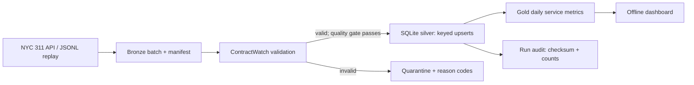

# Engineering Portfolio: CivicFlow + ContractWatch

Five runnable Python/SQL projects focused on reliable data systems and ML engineering. Python 3.11+. DemandServe uses NumPy; the other offline demos need only the standard library. No cloud account or credentials are needed for local demos.

**Cost policy: $0 out-of-pocket.** All enabled demos run locally; AWS deployment is disabled and the legacy deployment script now only packages files. See [cost policy](docs/cost-policy.md).

| Project | Problem | Implemented behavior |
| --- | --- | --- |
| [CivicFlow](docs/civicflow.md) | Public operational data contains corrections and invalid records | Bounded API extraction, immutable raw batches, transactional keyed upserts, quarantine, audit lineage, SQL reporting, offline dashboard |
| [ContractWatch](docs/contractwatch.md) | Upstream changes silently break downstream consumers | Versioned record contracts, observed-schema profiles, type/missingness drift, machine-readable reports, nonzero exit status on failures |
| [AWSFlow](docs/awsflow.md) | Cloud events can repeat or fail halfway through a batch | AWS S3/EventBridge/SQS/Lambda pipeline, commit-last manifests, Glue catalog, Athena partition projection, scoped IAM, CloudFormation, CloudWatch alarms |
| [LedgerStream](docs/ledgerstream.md) | Source changes and events can diverge, or retries can double-count aggregates | Transactional outbox, durable ordered checkpoints, replay detection, dead letters, entity versions, delete tombstones, atomic projection recovery |
| [DemandServe](docs/demandserve.md) | Model metrics and serving logic can hide leakage or inconsistent features | Chronological evaluation, baseline comparisons, shared train/serve features, versioned ridge artifact, validated HTTP predictions |



## Run in five minutes

Run from this repository's root:

```bash
python3 -m pip install -r requirements-ml.txt
python3 -m unittest discover -s tests -v
python3 scripts/verify.py
python3 -m civicflow --input examples/requests.jsonl
python3 -m civicflow --input examples/requests.jsonl
python3 -m civicflow.report
python3 -m contractwatch examples/requests.jsonl --contract contracts/nyc311.json
```

The second load reports zero inserts and three unchanged records. Open `data/dashboard.html` in your browser. `scripts/verify.py` checks replay, an open-to-closed correction, a blocked bad batch, gold reconciliation, and sampled schema drift in an isolated temporary warehouse.

## Real-data run

```bash
python3 -m civicflow --fetch --start 2025-01-01 --end 2025-01-08 --max-rows 12000
python3 -m civicflow.report
```

Network access to NYC Open Data is required. The row cap keeps the experiment bounded. A `truncated: true` manifest means the sample does not cover the entire requested window. This is not a citywide sample or a throughput benchmark. See [verified evidence](evidence/real-data-verification.json) for the actual run and replay results.

Source: [NYC 311 Service Requests, 2020–present](https://data.cityofnewyork.us/Social-Services/311-Service-Requests-from-2020-to-Present/erm2-nwe9). API extraction selects only request ID, creation/closure times, agency, complaint type, borough, and status. It does not collect incident addresses, coordinates, names, or narrative text. Raw downloads and databases are ignored by Git; the checked-in examples are synthetic.

## Engineering decisions and limits

- SQLite makes transactions and failure recovery reproducible without cloud costs. This implementation is single-host, not a distributed lakehouse.
- Bronze is an append-only batch archive by convention; filesystem permissions do not enforce immutability. Silver is the latest accepted record per source key; gold is a SQL aggregate view.
- Incremental loading means existing keys are updated only when normalized content changes. Extraction uses explicit creation-time windows; re-fetching an overlapping window can catch corrections for those keys. This is not a source-update watermark or complete CDC. Older corrections outside the window require a backfill.
- API pagination is explicitly ordered, but the live API does not provide snapshot isolation. Concurrent source changes can affect a paginated extraction. Bronze replay is deterministic once downloaded.
- The default quality gate blocks a batch if more than 5% of records fail validation. Blocked batches remain in bronze with rejection details and do not change silver. Successful batches persist both warehouse updates and their run audit atomically.
- Closed-date averages exclude unresolved cases and are subject to selection bias. These metrics do not establish service quality or predict future resolution time.
- ContractWatch profiles an observed sample; rare types and absent fields can produce misleading drift signals. Configure thresholds and review changes rather than treating it as statistical proof.

See [design and recovery notes](docs/design.md) and [interview walkthrough](docs/interview-walkthrough.md).

## AWS project

```bash
python3 -m awsflow.demo
python3 infra/build_awsflow.py
```

AWSFlow has an [AWS preparation walkthrough](docs/awsflow-deployment.md) under the $0 project policy. Offline tests use an in-memory S3 adapter, and SDK shape checks use boto3 Stubber; these are separate from live cloud evidence. Glue here means the Data Catalog, not a Glue ETL job. Live deployment is disabled and unverified.

## Change-data and model-serving projects

```bash
python3 -m ledgerstream
python3 scripts/verify_demandserve_api.py
```

LedgerStream exercises actual local database transactions on synthetic orders, including an injected crash. DemandServe's trained artifact was evaluated on real historical UCI data and checked through a real loopback HTTP server. Neither is hosted as a production service. Read their project pages for exact technology boundaries and measured outcomes.

## Provenance

The initial implementation and verification were developed with Codex assistance. This repository records what the software does and the experiments run; it does not imply production deployment or independent authorship of every line. Resume use should follow hands-on review, rerunning the demos, and being able to explain the tradeoffs.

Code is MIT licensed. Source data remains governed by NYC's applicable terms and is not relicensed by this repository.
