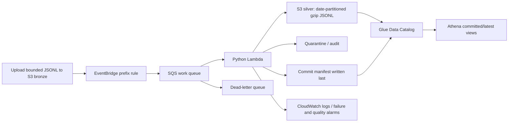

# AWSFlow: event-driven serverless data lake

AWS-specific implementation of a public-data pipeline. Developed with Codex assistance. Local verification and public source code are complete; cloud deployment and Athena execution are not yet verified.



## AWS skills demonstrated by the implementation

| Service | Concrete implementation |
| --- | --- |
| S3 | Private, encrypted, versioned data bucket; bounded bronze reads; date partitions; compressed silver; retention rules |
| EventBridge | Object-created events filtered to bronze, avoiding triggers from output writes |
| SQS | Buffering, visibility timeout, retries, DLQ, partial-batch handling |
| Lambda / boto3 | Version-specific GetObject, deterministic PutObject outputs, 8 MiB/20,000-row bounds, completion markers |
| IAM | Worker access scoped to bronze reads, selected output prefixes, one work queue, and its log group |
| Glue Data Catalog | Explicit schemas for silver and commit manifests; no crawler or Glue ETL job required |
| Athena | Date partition projection, commit-aware views, arrival-ordered record deduplication, reconciliation queries |
| CloudWatch | Structured logs, partial-failure/quality metrics, DLQ alarm, seven-day log retention |
| CloudFormation | Generated, checked-in infrastructure template and reproducible Lambda package |

## Local verification

```bash
python3 -m unittest discover -s tests -v
python3 -m awsflow.demo
python3 infra/build_awsflow.py
```

The demo writes an S3-shaped local output tree in `data/awsflow-offline/`. It processes the same event twice and verifies identical output bytes and a single completion key. Tests inject an output-write failure and verify no commit is published until recovery succeeds.

For real SDK shape checks without network calls:

```bash
python3 -m pip install -r requirements-aws-dev.txt
python3 scripts/verify_aws_sdk.py
cfn-lint infra/awsflow/template.json
```

See [offline evidence](../evidence/awsflow-offline-verification.json), [SDK evidence](../evidence/awsflow-sdk-verification.json), the [12,000-record public-data adapter check](../evidence/awsflow-public-data-verification.json), and the [deployment runbook](awsflow-deployment.md). The public-data run also executed locally and is not cloud evidence.

## Correctness and limits

- Delivery is at least once, not exactly once. Duplicate copies of the same source event overwrite deterministic content-addressed output keys instead of creating new logical objects. Bucket versioning still creates physical object versions, which the lifecycle policy expires.
- Input version IDs protect against processing the newest object accidentally when an older event arrives later.
- A multi-partition S3 write is not a transaction. Commit-last manifests let the supplied Athena views filter incomplete batches. Direct queries of the silver table can see uncommitted fragments. Athena queries themselves do not provide an atomic multi-object snapshot.
- Different input versions/batches can contain the same request. The supplied latest view deduplicates by request key and event arrival time. Arrival time does not prove upstream revision order; stale backfills can supersede newer corrections. Add source revision metadata before production use.
- A quality-blocked batch is acknowledged after quarantine/audit, rather than endlessly retried. Infrastructure failures are returned as partial batch failures and eventually reach the DLQ. Quality and failure alarms have no notification subscribers configured.
- Queries must filter a date range for practical partition pruning. The latest-record window/join may limit pushdown; inspect Athena's plan and scanned bytes after deployment rather than assuming a speedup.
- Outputs are gzip JSONL, not Parquet. This avoids Lambda dependency packaging and keeps the demo bounded; larger analytics workloads should compact to Parquet and use Glue/Spark or another batch engine.
- This is a bounded batch pipeline, not a high-volume streaming service. It has no VPC/NAT gateway, EMR cluster, Redshift cluster, or scheduled source polling.

## Official references

- [S3 events with EventBridge](https://docs.aws.amazon.com/AmazonS3/latest/userguide/enable-event-notifications-eventbridge.html)
- [Lambda partial SQS batch failures](https://docs.aws.amazon.com/lambda/latest/dg/services-sqs-errorhandling.html)
- [Athena partition projection](https://docs.aws.amazon.com/athena/latest/ug/partition-projection-setting-up.html)
- [Athena Hive JSON SerDe](https://docs.aws.amazon.com/athena/latest/ug/hive-json-serde.html)
- [AWS Free account plan](https://docs.aws.amazon.com/awsaccountbilling/latest/aboutv2/free-tier-plans.html)
