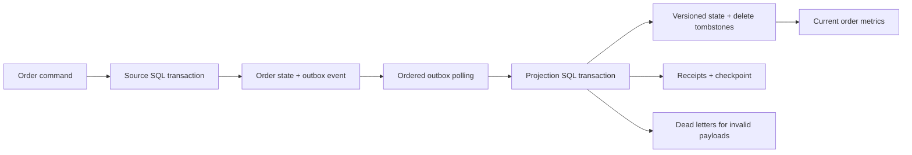

# LedgerStream: transactional outbox and durable change projection

A working local Python/SQL pipeline demonstrating how to avoid the dual-write problem: an application cannot reliably commit its order change and then independently publish an event without a crash window between them.

## Architecture



Run the complete exercise:

```bash
python3 -m ledgerstream
python3 -m unittest discover -s tests -p 'test_ledgerstream.py' -v
```

The demo creates two real SQLite databases in a temporary folder, emits four synthetic order changes, injects a projection crash, recovers, and replays the same events. It finishes with one paid order totaling 5,000 cents and one retained delete tombstone. See [verification](../evidence/ledgerstream-verification.json).

## Implemented behavior

- Atomic source update and outbox insertion in the same SQL transaction.
- Monotonic per-entity versions and ordered per-stream event sequence.
- State changes, event receipts, dead letters, and checkpoint updates in one sink transaction.
- Exact replay detection through event ID and SHA-256 envelope identity.
- Conflicting replays fail rather than silently changing an already consumed event.
- Source-sequence gaps block checkpoint advancement instead of skipping changes.
- Payload errors with valid routing metadata are quarantined and checkpointed, so a poison record does not block the stream forever. Missing routing metadata fails the batch.
- Delete tombstones preserve version ordering and prevent a stale upsert from resurrecting a deleted order.
- Aggregate SQL view reflects the current nondeleted orders, rather than adding revenue every time an event is replayed.

## Guarantees and limits

Replay-safe projection is scoped to this one transactional SQLite sink. It is not an exactly-once guarantee across external services. Event receipt retention is unbounded in this demo; production needs a retention/replay policy. Invalid events are intentionally consumed into a dead-letter table; correcting one requires a new higher-sequence event, not rewriting history.

This is application-driven outbox CDC, not PostgreSQL WAL/log-based capture. It uses an ordered polling interface and local replay; Kafka, Debezium, and PostgreSQL were not deployed. Docker was unavailable in the development environment. The event envelope is project-specific, not a claimed Debezium adapter.

To extend it: move the source/outbox transaction to PostgreSQL, publish committed outbox rows to Kafka, partition by stream/entity, and preserve atomic projection/checkpoint behavior in the target store. Compare the [Debezium PostgreSQL connector](https://debezium.io/documentation/reference/connectors/postgresql.html) before designing a WAL-based adapter; source offsets and row revision identity are different from this demo's sequence/version.

## Interview exercise

Explain why retrying an event must not increment revenue twice; demonstrate the injected crash; show that the checkpoint rolls back with state; delete an order; replay its older update; and explain why a tombstone is necessary. Add a test for one failure mode yourself before describing your personal contribution.

Developed with Codex assistance. No real orders or financial transactions are processed.
